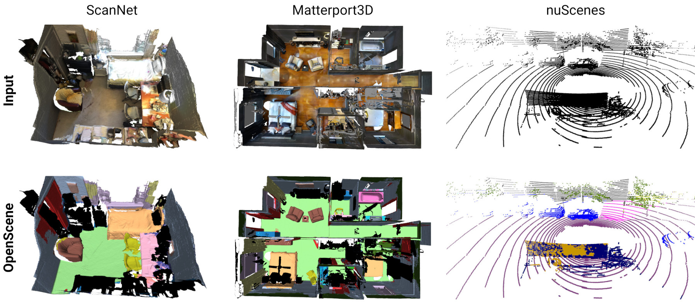

<!-- PROJECT LOGO -->

<p align="center">

  <h1 align="center">OpenScene: 3D Scene Understanding with Open Vocabularies</h1>
  <p align="center">
    <a href="https://pengsongyou.github.io"><strong>Songyou Peng</strong></a>
    ·
    <a href="https://www.kylegenova.com/"><strong>Kyle Genova</strong></a>
    ·
    <a href="https://www.maxjiang.ml/"><strong>Chiyu "Max" Jiang</strong></a>
    ·
    <a href="https://taiya.github.io/"><strong>Andrea Tagliasacchi</strong></a>
    <br>
    <a href="https://people.inf.ethz.ch/pomarc/"><strong>Marc Pollefeys</strong></a>
    ·
    <a href="https://www.cs.princeton.edu/~funk/"><strong>Thomas Funkhouser</strong></a>
  </p>
  <h2 align="center">CVPR 2023</h2>
  <h3 align="center"><a href="https://arxiv.org/abs/2211.15654">Paper</a> | <a href="https://youtu.be/jZxCLHyDJf8">Video</a> | <a href="https://pengsongyou.github.io/openscene">Project Page</a></h3>
  <div align="center"></div>
</p>
<p align="center">
  <a href="">
    
  </a>
</p>
<p align="center">
<strong>OpenScene</strong> is a zero-shot approach to perform a series of novel 3D scene understanding tasks using open-vocabulary queries.
</p>
<br>

<!-- TABLE OF CONTENTS -->
<details open="open" style='padding: 10px; border-radius:5px 30px 30px 5px; border-style: solid; border-width: 1px;'>
  <summary>Table of Contents</summary>
  <ol>
    <li>
      <a href="#interactive-demo">Interactive Demo</a>
    </li>
    <li>
      <a href="#installation">Installation</a>
    </li>
    <li>
      <a href="#datasets">Datasets</a>
    </li>
    <li>
      <a href="#run">Run</a>
    </li>
    <li>
      <a href="#applications">Applications</a>
    </li>
    <li>
      <a href="#todo">TODO</a>
    </li>
    <li>
      <a href="#acknowledgement">Acknowledgement</a>
    </li>
    <li>
      <a href="#citation">Citation</a>
    </li>
  </ol>
</details>

## News :triangular_flag_on_post:

- [2023/03/31] Code is released.

## Interactive Demo
### No GPU is needed! Follow **[this instruction](./demo)** to set up and play with the real-time demo yourself.

<p align="center">
  
</p>


Here we present a **real-time**, **interactive**, **open-vocabulary** scene understanding tool. A user can type in an arbitrary query phrase like **`snoopy`** (rare object), **`somewhere soft`** (property), **`made of metal`** (material), **`where can I cook?`** (activity), **`festive`** (abstract concept) etc, and the correponding regions are highlighted.


## Installation
Follow the [installation.md](installation.md) to install all required packages so you can do the evaluation & distillation afterwards.

## Datasets

We provide the **pre-processed 3D&2D data** and **multi-view fused features** for the following datasets:
- ScanNet
- Matterport3D
- nuScenes
- Replica
### Pre-processed 3D&2D Data
You can preprocess the dataset yourself, see the [data pre-processing instruction](scripts/preprocess/README.md).


Alternatively, we have provided the preprocessed datasets. One can download the pre-processed datasets by running the script below, and following the command line instruction to download the corresponding datasets:
```bash
bash scripts/download_dataset.sh
```
The script will download and unpack data into the folder `data/`. One can also download the dataset somewhere else, but link to the corresponding folder with the symbolic link:
```bash
ln -s /PATH/TO/DOWNLOADED/FOLDER data
```
<details>
  <summary><strong>List of provided processed data</strong> (click to expand):</summary>
  
  - ScanNet 3D (point clouds with GT semantic labels)
  - ScanNet 2D (RGB-D images with camera poses)
  - Matterport 3D (point clouds with GT semantic labels)
  - Matterport 2D (RGB-D images with camera poses)
  - nuScenes 3D (lidar point clouds with GT semantic labels)
  - nuScenes 2D (RGB images with camera poses)
  - Replica 3D (point clouds)
  - Replica 2D (RGB-D images)
  - Matterport 3D with top 40 NYU classes
  - Matterport 3D with top 80 NYU classes
  - Matterport 3D with top 160 NYU classes
</details>

**Note**: 2D processed datasets (e.g. `scannet_2d`) are only needed if you want to do multi-view feature fusion on your own. If so, please follow the [instruction for multi-view fusion](./scripts/feature_fusion/README.md).

### Multi-view Fused Features
To evaluate our OpenScene model or distill a 3D model, one needs to have the multi-view fused image feature for each 3D point (see method in Sec. 3.1 in the paper).

You can run the following to directly download provided fused features:

```bash
bash scripts/download_fused_features.sh
```
<details>
  <summary><strong>List of provided fused features</strong> (click to expand):</summary>
  
  - ScanNet - Multi-view fused OpenSeg features, train/val (234.8G)
  - ScanNet - Multi-view fused LSeg features, train/val (175.8G)
  - Matterport - Multi-view fused OpenSeg features, train/val (198.3G)
  - Matterport - Multi-view fused OpenSeg features, test set (66.7G)
  - Replica - Multi-view fused OpenSeg features (9.0G)
  - Matterport - Multi-view fused LSeg features (coming)
  - nuScenes - Multi-view fused OpenSeg features (coming)
  - nuScenes - Multi-view fused LSeg features (coming)
</details>


Alternatively, you can also generate multi-view features yourself following the [instruction](./scripts/feature_fusion/README.md).


## Run
When you have installed the environment and obtained the **processed 3D data** and **multi-view fused features**, you are ready to run our OpenScene disilled/ensemble model for 3D semantic segmentation, or distill your own model from scratch.

### Evaluation for 3D Semantic Segmentation with a Pre-defined Labelsets
<p align="center">
  
</p>

Here you can evaluate OpenScene features on different dataset (ScanNet/Matterport3D/nuScenes/Replica) that have pre-defined labelsets.
We already include the following labelsets in [label_constants.py](dataset/label_constants.py):
- ScanNet 20 classes (`wall`, `door`, `chair`, ...)
- Matterport3D 21 classes (ScanNet 20 classes + `floor`)
- Matterport top 40, 80, 160 NYU classes (more rare object classes)
- nuScenes 16 classes (`road`, `bicycle`, `sidewalk`, ...)

The general command to run evaluation:
```bash
sh run/eval.sh EXP_DIR CONFIG.yaml feature_type
```
where you specify your experiment directory `EXP_DIR`, and replace `CONFIG.yaml` with the correct config file under [`config/`](./config/). **`feature_type`** corresponds to per-point OpenScene features:
- `fusion`: The 2D multi-view fused features
- `distill`: features from 3D distilled model 
- `ensemble`: Our 2D-3D ensemble features

To evaluate with `distill` and `ensemble`, the easiest way is to use a pre-trained 3D distilled model. You can do this by using one of the config files with postfix `_pretrained`. 

For example, to evaluate the semantic segmentation on Replica, you can simply run:
```bash
# 2D-3D ensemble
sh run/eval.sh out/replica_openseg config/replica/ours_openseg_pretrained.yaml ensemble

# Run 3D distilled model
sh run/eval.sh out/replica_openseg config/replica/ours_openseg_pretrained.yaml distill

# Evaluate with 2D fused features
sh run/eval.sh out/replica_openseg config/replica/ours_openseg_pretrained.yaml fusion
```
The script will automatically download the pretrained 3D model and run the evaluation for Matterport 21 classes.
You can find all outputs in the `out/replica_openseg`.

For evaluation options, see under `TEST` inside `config/replica/ours_openseg_pretrained.yaml`. Below are important evaluation options that you might want to modify:
- `labelset` (default: None, `scannet`| `matterport` | `matterport40`| `matterport80`|`matterport160`): Evaluate on a specific pre-defined labelset in [label_constants.py](./dataset/label_constants.py). If not specified, same as your 3D point cloud folder name
- `eval_iou` (default: True): whether evaluating the mIoU. Set to `False` if there is no GT labels
- `save_feature_as_numpy` (default: False): save the per-point features as `.npy`
- `prompt_eng` (default: True): input class name X -> "a X in a scene"
- `vis_gt` (default: True):  visualize point clouds with GT semantic labels
- `vis_pred` (default: True): visualize point clouds with our predicted semantic labels
- `vis_input` (default: True): visualize input point clouds

If you want to use a 3D model distilled from scratch, specify the `model_path` to the correponding checkpoints `EXP/model/model_best.pth.tar`.


### Distillation
Finally, if you want to distill a new 3D model from scratch, run:

- Start distilling:
```sh run/distill.sh EXP_NAME CONFIG.yaml```

- Resume: 
```sh run/resume_distill.sh EXP_NAME CONFIG.yaml```

For available distillation options, please take a look at `DISTILL` inside `config/matterport/ours_openseg.yaml`


### Using Your Own Datasets
1. Follow the [data preprocessing instruction](./scripts/preprocess/README.md), modify codes accordingly to obtain the processed 2D&3D data
2. Follow the [feature fusion instruction](./scripts/feature_fusion/README.md), modify codes to obtain multi-view fused features.
3. You can distill a model on your own, or take our provided 3D distilled model weights (e.g. our 3D model for ScanNet or Matterport3D), and modify the `model_path` accordingly.
4. If you want to evaluate on a specific labelset, change the `labelset` in config.


## Applications
Besides the zero-shot 3D semantic segmentation, we can perform also the following tasks:
- **Open-vocabulary 3D scene understanding and exploration**: query a 3D scene to understand properties that extend beyond fixed category labels, e.g. materials, activity, affordances, room type, abstract concepts...
- **Rare object search**: query a 3D scene database to find rare examples based on their names
- **Image-based 3D object detection**: query a 3D scene database to retrieve examples based on similarities to a given input image

## Acknowledgement
We sincerely thank Golnaz Ghiasi for providing guidance on using OpenSeg model. Our appreciation extends to Huizhong Chen, Yin Cui, Tom Duerig, Dan Gnanapragasam, Xiuye Gu, Leonidas Guibas, Nilesh Kulkarni, Abhijit Kundu, Hao-Ning Wu, Louis Yang, Guandao Yang, Xiaoshuai Zhang, Howard Zhou, and Zihan Zhu for helpful discussion. We are also grateful to Charles R. Qi and Paul-Edouard Sarlin for their proofreading.

We build some parts of our code on top of the [BPNet repository](https://github.com/wbhu/BPNet).


## TODO
- [ ] Support demo for arbitrary scenes
- [ ] Support in-webiste demo
- [ ] Support multi-view feature fusion with LSeg and OVSeg
- [ ] Add missing multi-view fusion feature for Matterport & nuScenes
- [ ] Multi-view feature fusion code for nuScenes
- [ ] Support the latest PyTorch version

We are very much welcome all kinds of contributions to the project.

## Citation
If you find our code or paper useful, please cite
```bibtex
@inproceedings{Peng2023OpenScene,
  title     = {OpenScene: 3D Scene Understanding with Open Vocabularies},
  author    = {Peng, Songyou and Genova, Kyle and Jiang, Chiyu "Max" and Tagliasacchi, Andrea and Pollefeys, Marc and Funkhouser, Thomas},
  booktitle = {Proceedings of the IEEE/CVF Conference on Computer Vision and Pattern Recognition (CVPR)},
  year      = {2023}
```
